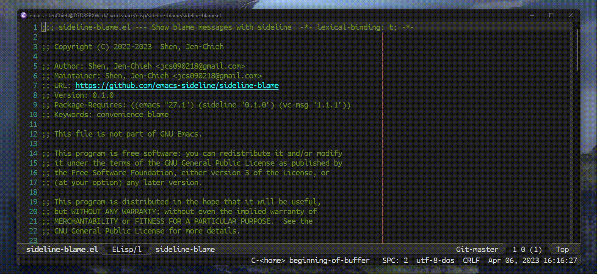

[](https://www.gnu.org/licenses/gpl-3.0)
[](https://jcs-emacs.github.io/jcs-elpa/#/sideline-blame)
[](https://melpa.org/#/sideline-blame)
[](https://stable.melpa.org/#/sideline-blame)

# sideline-blame
> Show blame messages with sideline

[](https://github.com/emacs-sideline/sideline-blame/actions/workflows/test.yml)



Supported source control are listed in [vc-msg](https://github.com/redguardtoo/vc-msg).

Currently supports the following:

* Git
* Mercurial
* Subversion
* Perforce

*P.S. See their homepage for the newest support!*

## 🔨 Quickstart

```elisp
(use-package sideline-blame
  :init
  (setq sideline-backends-left '((sideline-blame . down))))
```

Then open a file with source control, then do:

```
M-x sideline-mode
```

If you want to enable it everywhere, put this line in your `init.el`:

```elisp
(global-sideline-mode 1)
```

See library [sideline](https://github.com/emacs-sideline/sideline) for more
information.

## 🔧 Customization

#### 🧪 Variables

* `sideline-blame-uncommitted-author-name` - Message for commits where you are author.
* `sideline-blame-uncommitted-message` - Message for uncommitted lines.

#### 🧪 Face

* `sideline-blame` - Face for blame info.

## 🔗 References

* [vc-msg](https://github.com/redguardtoo/vc-msg)
* [blamer.el](https://github.com/Artawower/blamer.el)

## 🛠️ Contribute

[](http://makeapullrequest.com)
[](https://github.com/bbatsov/emacs-lisp-style-guide)
[](https://www.paypal.me/jcs090218)
[](https://www.patreon.com/jcs090218)

If you would like to contribute to this project, you may either
clone and make pull requests to this repository. Or you can
clone the project and establish your own branch of this tool.
Any methods are welcome!

### 🔬 Development

To run the test locally, you will need the following tools:

- [Eask](https://emacs-eask.github.io/)
- [Make](https://www.gnu.org/software/make/) (optional)

Install all dependencies and development dependencies:

```sh
$ eask install-deps --dev
```

To test the package's installation:

```sh
$ eask package
$ eask install
```

To test compilation:

```sh
$ eask compile
```

**🪧 The following steps are optional, but we recommend you follow these lint results!**

The built-in `checkdoc` linter:

```sh
$ eask lint checkdoc
```

The standard `package` linter:

```sh
$ eask lint package
```

*📝 P.S. For more information, find the Eask manual at https://emacs-eask.github.io/.*

## ⚜️ License

This program is free software; you can redistribute it and/or modify
it under the terms of the GNU General Public License as published by
the Free Software Foundation, either version 3 of the License, or
(at your option) any later version.

This program is distributed in the hope that it will be useful,
but WITHOUT ANY WARRANTY; without even the implied warranty of
MERCHANTABILITY or FITNESS FOR A PARTICULAR PURPOSE.  See the
GNU General Public License for more details.

You should have received a copy of the GNU General Public License
along with this program.  If not, see <https://www.gnu.org/licenses/>.

See [`LICENSE`](./LICENSE.txt) for details.
